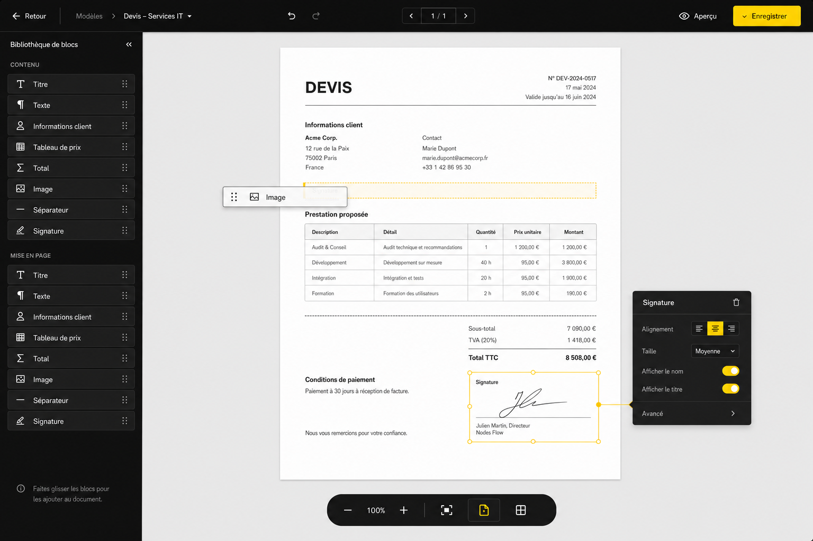

# T005 — Mise à jour du modèle de devis sur Flow

## Objectif

Faire évoluer l’éditeur de modèles PDF de Flow vers un éditeur visuel par blocs permettant de construire et personnaliser un devis sans modifier du code.

Le modèle reste rattaché à l’outil **Génération de PDF** d’un agent.

## Maquette



La maquette présente quatre zones principales :

1. une barre d’actions supérieure ;
2. une bibliothèque de blocs à gauche ;
3. un canevas central représentant le document PDF ;
4. un panneau contextuel de propriétés.

## Parcours utilisateur

```text
Agent IA
    ↓
Capacités
    ↓
Génération de PDF
    ↓
Gestion des modèles
    ↓
Création ou modification d’un modèle
    ↓
Éditeur visuel
    ↓
Aperçu puis enregistrement
```

## Barre d’actions

La barre supérieure permet de :

- revenir à la liste des modèles ;
- consulter le nom du modèle actif ;
- annuler ou rétablir une modification ;
- naviguer entre les pages ;
- ouvrir l’aperçu du document ;
- enregistrer les changements.

## Bibliothèque de blocs

Les blocs peuvent être ajoutés au document par glisser-déposer.

Blocs prévus :

- titre ;
- texte ;
- informations client ;
- tableau de prix ;
- total ;
- image ou logo ;
- séparateur ;
- signature.

Chaque bloc possède un identifiant stable, un type, une position, un ordre et une configuration.

## Canevas du document

Le canevas central représente une page PDF au format A4.

Fonctions attendues :

- déposer un bloc à un emplacement précis ;
- sélectionner un bloc ;
- déplacer et réordonner les blocs ;
- afficher les limites du bloc sélectionné ;
- supprimer ou dupliquer un bloc ;
- gérer plusieurs pages ;
- ajuster le zoom ;
- prévisualiser le rendu final.

## Panneau de propriétés

Le panneau s’adapte au bloc sélectionné.

Exemple pour une signature :

- alignement ;
- taille ;
- affichage du nom ;
- affichage du titre ;
- options avancées.

Autres propriétés possibles :

- contenu et variables dynamiques ;
- typographie ;
- couleurs ;
- marges et espacements ;
- bordures ;
- largeur des colonnes ;
- format des montants ;
- visibilité conditionnelle.

## Structure de données proposée

```json
{
  "name": "Devis — Services IT",
  "template_type": "facturation",
  "page": {
    "format": "A4",
    "orientation": "portrait",
    "margin": {
      "top": 40,
      "right": 40,
      "bottom": 40,
      "left": 40
    }
  },
  "blocks": [
    {
      "id": "block_title",
      "type": "title",
      "order": 1,
      "config": {
        "text": "DEVIS",
        "align": "left"
      }
    },
    {
      "id": "block_customer",
      "type": "customer_information",
      "order": 2,
      "config": {
        "show_company": true,
        "show_contact": true,
        "show_address": true
      }
    },
    {
      "id": "block_prices",
      "type": "price_table",
      "order": 3,
      "config": {
        "columns": [
          "description",
          "detail",
          "quantity",
          "unit_price",
          "amount"
        ]
      }
    },
    {
      "id": "block_signature",
      "type": "signature",
      "order": 4,
      "config": {
        "align": "center",
        "size": "medium",
        "show_name": true,
        "show_title": true
      }
    }
  ]
}
```

## Variables dynamiques

Les blocs doivent pouvoir utiliser des variables remplacées lors de la génération :

- informations de l’organisation ;
- informations du client ;
- numéro et date du devis ;
- durée de validité ;
- lignes de prestations ;
- sous-total ;
- taxes ;
- total TTC ;
- conditions de paiement ;
- signataire.

Une variable inconnue doit être signalée dans l’éditeur avant l’enregistrement.

## Processus de génération

```text
L’agent collecte les informations du devis
    ↓
Flow charge le modèle connecté
    ↓
Les variables dynamiques sont injectées
    ↓
Les blocs sont rendus dans leur ordre
    ↓
Le document est converti en PDF
    ↓
Le PDF est enregistré puis envoyé au client
```

## Règles fonctionnelles

- Les modifications ne doivent pas affecter un modèle publié avant l’enregistrement.
- L’aperçu et le PDF final doivent utiliser le même moteur de rendu.
- Le document doit rester imprimable au format A4.
- Un bloc sélectionné doit afficher immédiatement ses propriétés.
- Les actions de déplacement doivent pouvoir être annulées et rétablies.
- Les blocs obligatoires doivent être validés avant la publication.
- Les montants doivent respecter la devise et le format régional configurés.
- Le contenu doit rester dans les limites imprimables de la page.
- Un modèle existant doit pouvoir être chargé et migré vers la structure par blocs.

## États à prévoir

- chargement du modèle ;
- modèle vide ;
- bloc en cours de déplacement ;
- bloc sélectionné ;
- modification non enregistrée ;
- sauvegarde en cours ;
- sauvegarde réussie ou échouée ;
- variable invalide ;
- contenu dépassant la page ;
- aperçu en cours de génération ;
- erreur de génération PDF.

## Critères d’acceptation

- L’utilisateur peut créer un modèle de devis depuis l’interface.
- Les blocs peuvent être ajoutés, déplacés, configurés et supprimés.
- Le panneau de propriétés correspond au bloc sélectionné.
- L’utilisateur peut annuler et rétablir ses modifications.
- Le zoom et la navigation entre les pages fonctionnent.
- L’aperçu correspond au document PDF généré.
- Le modèle peut être enregistré et réutilisé par l’agent.
- Les anciens modèles restent exploitables après migration.
