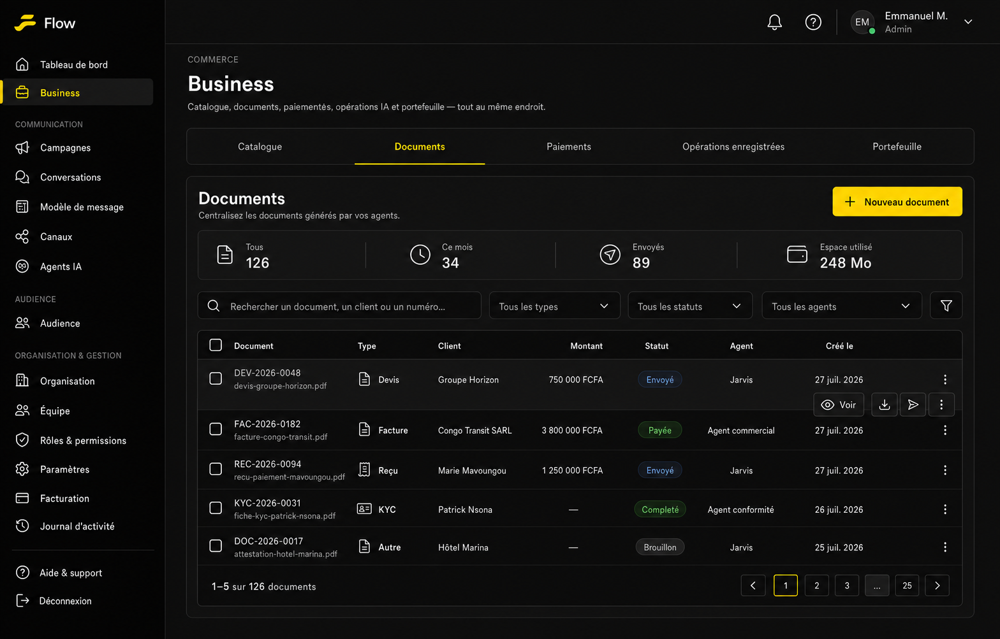

# T006 — Registre des documents générés dans Business

## Objectif

Ajouter un onglet **Documents** à la page Business de Flow afin de centraliser tous les documents générés par les agents.

La fonctionnalité n’est pas limitée aux devis. Elle doit pouvoir stocker et suivre :

- les devis ;
- les factures ;
- les reçus ;
- les fiches KYC ;
- les attestations ;
- les rapports ;
- tout autre document PDF généré par Flow.

## Maquette



L’onglet **Documents** est intégré à la navigation Business existante :

```text
Catalogue
Documents
Paiements
Opérations enregistrées
Portefeuille
```

## Parcours utilisateur

```text
Un agent ou un utilisateur génère un document
    ↓
Le PDF est stocké
    ↓
Une entrée est créée dans le registre Business
    ↓
L’utilisateur recherche ou filtre le document
    ↓
Il peut le consulter, le télécharger ou l’envoyer
```

## Indicateurs

La barre de synthèse affiche :

- le nombre total de documents ;
- les documents créés pendant le mois ;
- les documents envoyés ;
- l’espace de stockage utilisé.

Ces indicateurs doivent rester compacts et peuvent agir comme filtres rapides.

## Table des documents

### Colonnes principales

| Colonne | Description |
|---|---|
| Document | Numéro, nom et nom du fichier |
| Type | Devis, facture, reçu, KYC ou autre |
| Client | Contact ou entreprise associés |
| Montant | Montant du document financier, si applicable |
| Statut | État courant du document |
| Agent | Agent ayant généré le document |
| Créé le | Date et heure de génération |
| Actions | Voir, télécharger, envoyer et autres actions |

Le montant est facultatif. Une fiche KYC, une attestation ou un rapport peuvent ne contenir aucun montant.

## Recherche et filtres

L’utilisateur peut rechercher par :

- numéro de document ;
- nom de fichier ;
- client ;
- entreprise ;
- référence externe.

Filtres prévus :

- type de document ;
- statut ;
- agent ;
- période de création ;
- client ;
- présence ou absence d’un montant.

## Types de documents

Types initiaux proposés :

```text
quote       → Devis
invoice     → Facture
receipt     → Reçu
kyc         → Fiche KYC
certificate → Attestation
report      → Rapport
other       → Autre
```

Le type doit être extensible sans nécessiter une modification importante de l’interface.

## Statuts

### Cycle générique

```text
Brouillon
    ↓
Généré
    ↓
Envoyé
    ↓
Consulté
```

### Statuts complémentaires

Selon le type du document :

- accepté ou refusé pour un devis ;
- payé ou impayé pour une facture ;
- complété ou à vérifier pour une fiche KYC ;
- expiré ;
- annulé ;
- archivé ;
- erreur de génération.

Le statut courant et l’historique des changements doivent être conservés séparément.

## Actions disponibles

Actions communes :

- afficher l’aperçu ;
- télécharger le fichier ;
- envoyer ou renvoyer sur WhatsApp ;
- copier un lien sécurisé ;
- consulter la conversation associée ;
- archiver ;
- supprimer selon les permissions.

Actions conditionnelles :

- accepter ou refuser un devis ;
- convertir un devis en facture ;
- enregistrer le paiement d’une facture ;
- vérifier une fiche KYC ;
- régénérer un document en erreur.

## Fiche détaillée d’un document

La sélection d’un document ouvre une page ou un panneau contenant :

- l’aperçu du PDF ;
- le numéro et le type ;
- le statut courant ;
- le client associé ;
- l’agent ayant généré le fichier ;
- le modèle utilisé ;
- la conversation source ;
- le montant et la devise, si applicables ;
- la date de création et d’expiration ;
- les métadonnées ;
- l’historique des événements ;
- les actions disponibles.

## Structure de données proposée

```json
{
  "id": "document_uuid",
  "organization_id": "organization_uuid",
  "document_number": "DEV-2026-0048",
  "name": "Devis Groupe Horizon",
  "document_type": "quote",
  "status": "sent",
  "file_name": "devis-groupe-horizon.pdf",
  "file_path": "generated-documents/organization_uuid/DEV-2026-0048.pdf",
  "mime_type": "application/pdf",
  "file_size": 248350,
  "customer_id": "customer_uuid",
  "agent_id": "agent_uuid",
  "conversation_id": "conversation_uuid",
  "template_id": "template_uuid",
  "tariff_grid_id": "tariff_grid_uuid",
  "amount": 750000,
  "currency": "XAF",
  "metadata": {},
  "generated_at": "2026-07-27T10:14:00Z",
  "sent_at": "2026-07-27T10:15:00Z",
  "viewed_at": null,
  "expires_at": "2026-08-10T23:59:59Z",
  "created_at": "2026-07-27T10:14:00Z",
  "updated_at": "2026-07-27T10:15:00Z"
}
```

Les champs `amount`, `currency`, `tariff_grid_id` et `expires_at` sont optionnels.

## Historique des événements

Chaque document possède un journal d’événements :

```json
{
  "document_id": "document_uuid",
  "event_type": "sent",
  "actor_type": "agent",
  "actor_id": "agent_uuid",
  "metadata": {
    "channel": "whatsapp"
  },
  "created_at": "2026-07-27T10:15:00Z"
}
```

Événements possibles :

- génération demandée ;
- génération terminée ;
- génération échouée ;
- fichier téléchargé ;
- document envoyé ;
- document consulté ;
- statut modifié ;
- document archivé ;
- document supprimé.

## Stockage

Les fichiers sont stockés dans Supabase Storage.

Convention de chemin proposée :

```text
generated-documents/{organization_id}/{year}/{month}/{document_id}.pdf
```

Règles :

- accès limité à l’organisation propriétaire ;
- URL publique permanente interdite ;
- utilisation d’URL signées temporaires ;
- conservation du nom original dans les métadonnées ;
- suppression du fichier coordonnée avec celle de l’enregistrement ;
- taille et type MIME validés.

## Permissions

Permissions proposées :

- `documents.read` ;
- `documents.create` ;
- `documents.send` ;
- `documents.update_status` ;
- `documents.archive` ;
- `documents.delete`.

Les suppressions et accès aux documents KYC doivent être journalisés.

## Connexion avec T005 et T007

```text
T007 — Calcul depuis une grille CSV
    ↓
Données tarifaires et résultat
    ↓
T005 — Rendu avec un modèle de document
    ↓
Génération du PDF
    ↓
T006 — Stockage, recherche et suivi dans Business
```

T006 doit aussi accepter les documents générés sans T007, par exemple une fiche KYC ou une attestation.

## États à prévoir

- chargement de la table ;
- aucun document ;
- génération en cours ;
- document prêt ;
- envoi en cours ;
- document envoyé ;
- erreur de génération ;
- fichier indisponible ;
- accès refusé ;
- document archivé ;
- suppression en cours ;
- recherche sans résultat.

## Critères d’acceptation

- Un onglet **Documents** est disponible dans Business.
- Tous les types de documents générés peuvent être enregistrés.
- Les documents sont isolés par organisation.
- La table peut être recherchée, filtrée et paginée.
- Le montant reste optionnel.
- Un document peut être prévisualisé, téléchargé et envoyé.
- Chaque document conserve son agent, son client, son modèle et sa conversation d’origine.
- Les fichiers sont servis par des URL signées.
- Les changements de statut et actions importantes sont historisés.
- Les documents produits par T005 et T007 apparaissent automatiquement dans le registre.
