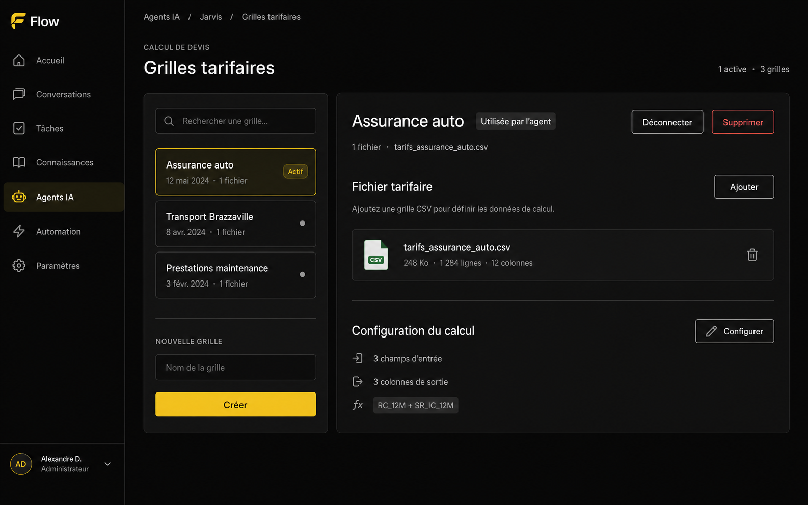
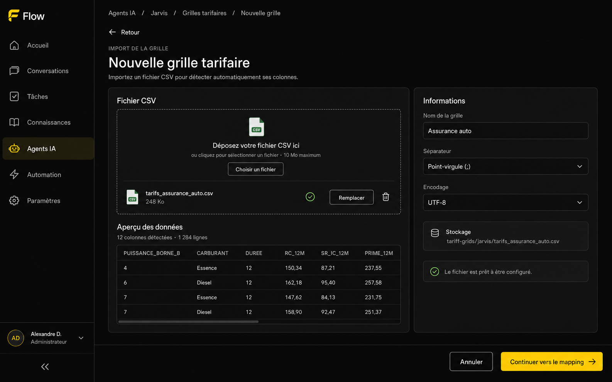
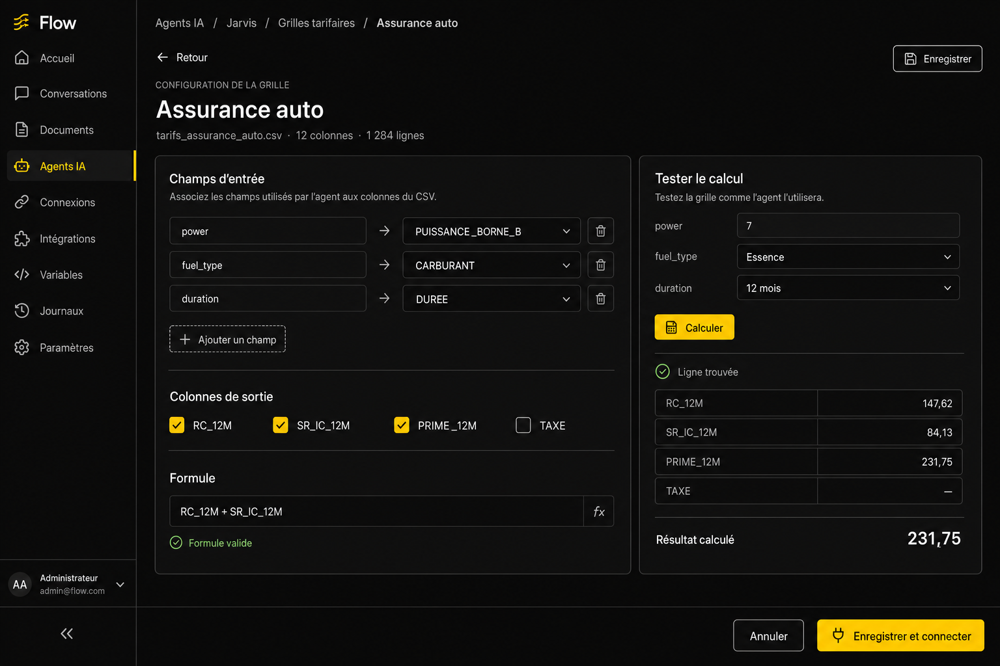

# T007 — Calcul de devis à partir d’un CSV

## Objectif

Ajouter à un agent Flow un outil générique capable de calculer un prix ou un devis depuis une grille tarifaire CSV.

Aucune règle métier n’est codée en dur. Le fonctionnement dépend uniquement :

- du fichier CSV fourni par l’utilisateur ;
- du mapping entre les champs attendus par l’agent et les colonnes du CSV ;
- des colonnes à retourner ;
- de la formule configurée.

## Maquettes

### 1. Gestion des grilles tarifaires



Cette page reprend le parcours de l’outil « Recherche dans les fichiers ». Elle est accessible depuis l’onglet **Capacités** d’un agent.

Fonctions prévues :

- rechercher une grille ;
- créer une grille ;
- sélectionner une grille existante ;
- connecter ou déconnecter une grille de l’agent ;
- modifier ou supprimer une grille ;
- consulter le fichier et le résumé de sa configuration.

### 2. Import et analyse du CSV



Processus :

1. L’utilisateur nomme la grille.
2. Il dépose un fichier CSV.
3. Le fichier est envoyé dans Supabase Storage.
4. L’application détecte le séparateur, l’encodage, les en-têtes et le nombre de lignes.
5. Un aperçu des données est affiché avant de continuer.

Le chemin du fichier est conservé dans `csv_path`.

### 3. Mapping, formule et test



L’utilisateur configure :

- les champs que l’agent devra fournir ;
- la colonne CSV associée à chaque champ ;
- les colonnes à retourner ;
- la formule à appliquer ;
- un jeu de données de test.

Le testeur recherche une ligne correspondante et affiche les valeurs récupérées ainsi que le résultat final.

## Configuration proposée

```json
{
  "name": "Assurance auto",
  "csv_path": "tariff-grids/jarvis/tarifs_assurance_auto.csv",
  "input_mapping": {
    "power": "PUISSANCE_BORNE_B",
    "fuel_type": "CARBURANT",
    "duration": "DUREE"
  },
  "output_columns": [
    "RC_12M",
    "SR_IC_12M",
    "PRIME_12M"
  ],
  "formula": "RC_12M + SR_IC_12M"
}
```

## Processus d’exécution

```text
Message client
    ↓
L’agent collecte les champs définis dans input_mapping
    ↓
Le runtime charge le CSV depuis csv_path
    ↓
Il cherche la ligne correspondant aux valeurs reçues
    ↓
Il récupère les output_columns
    ↓
Il évalue formula
    ↓
Il retourne le résultat et les valeurs de sortie à l’agent
```

## Règles fonctionnelles

- Une grille appartient à une organisation et peut être rattachée à un agent.
- Les colonnes utilisées dans le mapping, les sorties et la formule doivent exister dans le CSV.
- La formule ne doit accepter que les opérateurs et fonctions explicitement autorisés.
- L’évaluation ne doit jamais utiliser `eval`.
- Les valeurs numériques doivent être normalisées, notamment les virgules décimales.
- Une erreur claire doit être retournée si aucune ligne ou plusieurs lignes correspondent.
- Le testeur utilise le même moteur de calcul que le runtime de production.
- Le remplacement d’un CSV doit déclencher une nouvelle validation de la configuration.

## États à prévoir

- grille sans fichier ;
- import en cours ou échoué ;
- CSV invalide ou vide ;
- en-têtes dupliqués ;
- configuration incomplète ;
- formule invalide ;
- grille prête ;
- grille connectée à l’agent ;
- aucune ligne trouvée ;
- plusieurs lignes trouvées ;
- calcul réussi.

## Critères d’acceptation

- L’utilisateur peut importer un CSV sans modifier le code.
- Les en-têtes sont détectés automatiquement.
- Le mapping et les sorties sont construits à partir des colonnes détectées.
- Une formule valide peut être enregistrée et exécutée.
- Le testeur produit le même résultat que le runtime.
- Une grille peut être créée, modifiée, connectée, déconnectée et supprimée.
- Le parcours reste rattaché à la page de l’agent, comme l’outil « Recherche dans les fichiers ».
